Insertion sites in Staph epi
================
Patricia Tran
13 August, 2026

# Overview

There 2 two main analysis, building on the same input data. All Staph
epi complete RefSeq genomes were downloaded from NCBI.

1.  Find where the IS elements were found on the genomes
2.  Defense and Anti-defense systems were found in the genomes

# Preparing the data

## Gather Staph epi Genomes

We used ncbi-datasets to download complete Staph epi genomes:

``` bash
datasets download genome taxon 'Staphylococcus epidermidis' --assembly-level complete --include genome,cds,protein,gbff --mag exclude --assembly-source 'RefSeq'
```

This downloaded 225 genomes, including the “reference” RP62A (which has
the accession ID: `GCF_000011925.1_genomic`). For reference, that list
is found on the github repository at
[NCBI-accessions.txt](./NCBI-accessions.txt)

## Extract coordinates and sequences

We created a python script that would use the GFF file downloaded from
Genbank and look for the gene dnaA (origin) and the rlmH gene. Then, it
extract 1Mbp downstream of the rlmH gene.

This script will create an individual FASTA file for each assembly,
where the coordinates are reoriented such that dnaA starts at position
bp=1, and creates a table that shows where rlmH should be plotted.

That script is called
[extract_dnaA_to_1Mbp_downstream_rlmH.py](extract_dnaA_to_1Mbp_downstream_rlmH.py)
and an example can be found on this repository. If you’d like to reuse
it, go inside the script and change the genbank file root directory and
output directory.

We run the script using the command:

    ls ncbi_dataset/data/*/*.gbff | wc -l
         225
    cd ~/StaphEpi
    python extract_dnaA_to_1Mbp_downstream_rlmH.py

Screen printout:

    python extract_dnaA_to_1Mbp_downstream_rlmH.py
    Skipping GCF_029691815.1_genomic.gbff: missing dnaA or rlmH

    Completed. Summary table: dnaA_to_rlmH_fasta_per_assembly_1Mbp/dnaA_rlmH_coordinates_1Mbp.tsv

The file
`dnaA_to_rlmH_fasta_per_assembly_1Mbp/dnaA_rlmH_coordinates_1Mbp.tsv`
contains the coordinates of the rlmH file.

    (base) ptran5@dep-apricot StaphEpi % head dnaA_to_rlmH_fasta_per_assembly_1Mbp/dnaA_rlmH_coordinates_1Mbp.tsv
    Assembly    Contig_ID   Strand  Extracted_Length    rlmH_relative_start rlmH_relative_end
    GCF_045945235.1 NZ_CP064644.1   +   1032156 31676   32156
    GCF_900086615.2 NZ_LT571449.1   +   1032173 31693   32173
    GCF_042464775.1 NZ_CP170250.1   +   1031608 31128   31608
    GCF_025558665.1 NZ_CP094728.1   +   1032164 31684   32164
    GCF_029691855.1 NZ_CP121518.1   -   847908  30317   30797
    GCF_016903555.1 NZ_CP069951.1   -   1030813 30333   30813
    GCF_021484865.1 NZ_CP090575.1   +   1032170 31690   32170
    GCF_045926605.1 NZ_CP064453.1   +   1032166 31686   32166
    GCF_045934295.1 NZ_CP064543.1   +   1032174 31694   32174

The file dnaA_rlmH_coordinates_1Mbp.tsv is copied here at
./tables/dnaA_rlmH_coordinates_1Mbp.tsv and contains 201 rows, excluding
the headers.

This python script was created with code assistance from genAI, and
verified by a human to ensure correctness.

Now, we have 201 out of 225 genomes now that have passed this first
filter.

Note that the `fasta` files in the folder
`dnaA_to_rlmH_fasta_per_assembly_1Mbp` are re-oriented. The columns rlmH
relative start and relative end are relative to the start of the fasta
sequence. Importantly, this means that the sequences and coordinates
from this folder might be different from one that we would download
directly from NCBI. This becomes important later on.

# Insertion sites

We will use 2 software programs to analyse the data generated from the
Python script. ISEScan and ISFinder.

For some reason, IS431mec is not in the ISEScan database, so we used the
sequence in ISFinder to search for that one specifically.

## ISFinder for IS431mec

Going on the ISFinder website, we scroll to find the IS431 sequence and
save it as a fasta file.

<https://isfinder.biotoul.fr/scripts/ficheIS.php?name=IS431mec>

Sequences `IS431-meclike.fasta`

    >IS431-meclike
    GGTTCTGTTGCAAAGTTGAATTTATAGTATAATTTTAACAAAAAGGAGTCTTCTGTATGAACTATTTCAGATATAAACAATTTAACAAGGATGTTATCAC
    TGTAGCCGTTGGCTACTATCTAAGATATACATTGAGTTATCGTGATATATCTGAAATATTAAGGGAACGTGGTGTAAACGTTCATCATTCAACGGTCTAC
    CGTTGGGTTCAAGAATATGCCCCAATTTTGTATCAAATTTGGAAGAAAAAGCATAAAAAAGCTTATTACAAATGGCGTATTGATGAGACGTACATCAAAA
    TAAAAGGAAAATGGAGCTATTTATATCGTGCCATTGATGCAGAGGGACATACATTAGATATTTGGTTGCGTAAGCAACGAGATAATCATTCAGCATATGC
    GTTTATCAAACGTCTCATTAAACAATTTGGTAAACCTCAAAAGGTAATTACAGATCAGGCACCTTCAACGAAGGTAGCAATGGCTAAAGTAATTAAAGCT
    TTTAAACTTAAACCTGACTGTCATTGTACATCGAAATATCTGAATAACCTCATTGAGCAAGATCACCGTCATATTAAAGTAAGAAAGACAAGGTATCAAA
    GTATCAATACAGCAAAGAATACTTTAAAAGGTATTGAATGTATTTACGCTCTATATAAAAAGAACCGCAGGTCTCTTCAGATCTACGGATTTTCGCCATG
    CCACGAAATTAGCATCATGCTAGCAAGTTAAGCGAACACTGACATGATAAATTAGTGGTTAGCTATATTTTTTTACTTTGCAACAGAACC

We created a Conda environment with the software blast. Then we use
BLAST to create a nucleotide database using the sequences created by the
python script `{genome}_dnaA_rlmH_coordinates.tsv`.

``` bash
# Create conda environment:
conda create -n blast
conda activate blast
conda install -c bioconda blast
         
# Check that it works:               
blastn -h
                      
# Cd into the results directory and concatenate all the fasta sequences prior to creating a database.  
cd ~/StaphEpi/dnaA_to_rlmH_fasta_per_assembly_1Mbp
cat *.fasta > all.fasta

# Make the blast DB.
makeblastdb -dbtype nucl -in all.fasta

# Use the FASTA sequence downloaded from ISFinder to perform a blast search.
cp ../IS431-meclike.fasta .
blastn -db all.fasta -query IS431-meclike.fasta -out blast_out_1Mbp.tsv -outfmt 6
                        
```

The results from the blast analysis (query, output TSV file, and db) are
found in the folder named [./blast/](./blast/) .

### Plotting the IS431 hits

We will use the BLAST table `blast_out.tsv`, which contains the
positions of the identified IS431mec elements along the 1Mbp, with the
file `dnaA_rlmH_coordinates.tsv` to plot where the IS431 elements are in
the genomes.

``` r
# Load packages
library(tidyverse)
```

    ## ── Attaching core tidyverse packages ──────────────────────── tidyverse 2.0.0 ──
    ## ✔ dplyr     1.2.1     ✔ readr     2.2.0
    ## ✔ forcats   1.0.1     ✔ stringr   1.6.0
    ## ✔ ggplot2   4.0.3     ✔ tibble    3.3.1
    ## ✔ lubridate 1.9.5     ✔ tidyr     1.3.2
    ## ✔ purrr     1.2.2     
    ## ── Conflicts ────────────────────────────────────────── tidyverse_conflicts() ──
    ## ✖ dplyr::filter() masks stats::filter()
    ## ✖ dplyr::lag()    masks stats::lag()
    ## ℹ Use the conflicted package (<http://conflicted.r-lib.org/>) to force all conflicts to become errors

``` r
# Import the blast output table
blast <- read.table("blast/blast_out_1Mbp.tsv",sep="\t")

# replace column names:
colnames(blast) <- c("qseqid","sseqid","pident","length","mismatch","gapopen","qstart","qend",
                     "sstart","send","evalue","bitscore")

# clean up the names:
blast <- blast %>% separate(sseqid, sep="_NZ|_NC", remove = FALSE, into=c("Assembly", "Accession"))


blast <- blast %>% mutate(Accession = ifelse(grepl("_NZ",sseqid), 
                                             paste0("NZ", Accession), 
                                             paste0("NC", Accession)))

blast$Accession <- str_replace(blast$Accession, "_dnaA0_.*","")

# Import rlmH positions tables
rlmH <- read.table("tables/dnaA_rlmH_coordinates_1Mbp.tsv", header=TRUE)
rlmH <- rlmH %>% filter(rlmH_relative_start >0)

# plot the blast results
ggplot(blast, aes(y=Accession))+
  geom_segment(aes(y=Accession, x=sstart, xend=send))
```

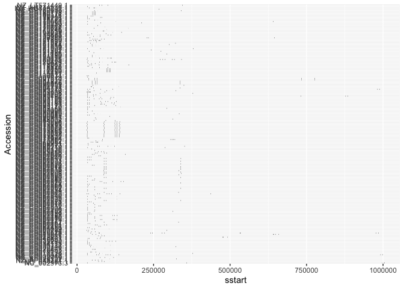<!-- -->

``` r
# Only plot high percent identify matches (>98%)
plot431mec <- blast %>% filter(pident > 98) %>%
  ggplot(aes(y=Accession))+
  geom_segment(aes(y=Accession, x=sstart, xend=send), col="red")+
  geom_segment(data = rlmH, aes(y=Contig_ID, x=rlmH_relative_start, xend= rlmH_relative_end), col="black")+
    geom_vline(xintercept = 0)+
  xlab("dnaA = bp position 0; black = rlmH gene, red = identified IS431meclike")+
  ylab("Accessions")+
  ggtitle("from origin to 1Mbp downstream of rlmH")+
  theme_minimal()+
  theme(axis.text.y = element_blank())+
  xlim(0,1000000)+
  #scale_x_continuous(breaks = seq(0,1000000,100000),
  #                   labels = seq(0,1000000,100000)/100000)+
  geom_vline(xintercept = 0)+

  coord_polar()+
  xlab("bp")+
  theme(plot.background = element_blank(),
        panel.background = element_blank())


plot431mec
```

    ## Warning: Removed 2 rows containing missing values or values outside the scale range
    ## (`geom_segment()`).

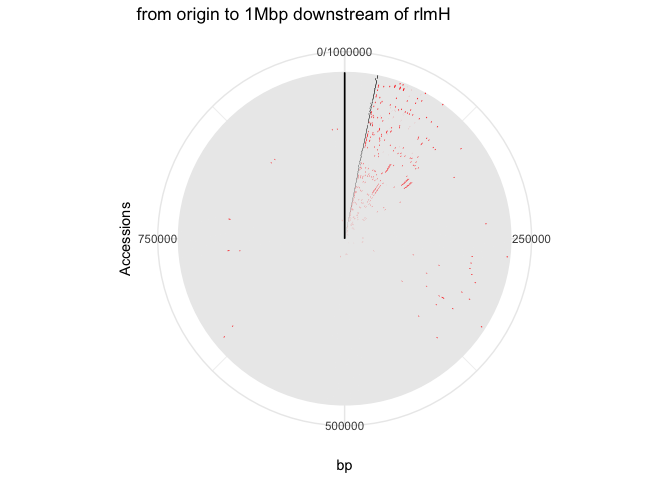<!-- -->

``` r
ggsave("figures/IS431mec_Sepi_1Mbp.pdf", width = 10, height = 4)
```

    ## Warning: Removed 2 rows containing missing values or values outside the scale range
    ## (`geom_segment()`).

``` r
# Linear plot:
plot431mec_linear <- blast %>% filter(pident > 98) %>%
  ggplot(aes(y=Accession))+
  geom_segment(aes(y=Accession, x=sstart, xend=send), col="black")+
  geom_segment(data = rlmH, aes(y=Contig_ID, x=rlmH_relative_start, xend= rlmH_relative_end), col="black")+
  geom_vline(xintercept = 0)+
  xlab("dnaA = bp position 0; black = rlmH gene, red = identified IS431meclike")+
  ylab("Accessions")+
  ggtitle("from origin to 1Mbp downstream of rlmH")+
  theme(axis.text.y = element_blank())+
  xlim(0,1000000)+
  #scale_x_continuous(breaks = seq(0,1000000,100000),
  #                   labels = seq(0,1000000,100000)/100000)+
  geom_vline(xintercept = 0)+
  xlab("bp")+
  theme(panel.background = element_blank(),
        axis.text.y = element_blank(),
        axis.ticks.y = element_blank(),
        axis.text = element_text(color="black"),
        panel.border = element_rect(color="black"))

plot431mec_linear
```

    ## Warning: Removed 2 rows containing missing values or values outside the scale range
    ## (`geom_segment()`).

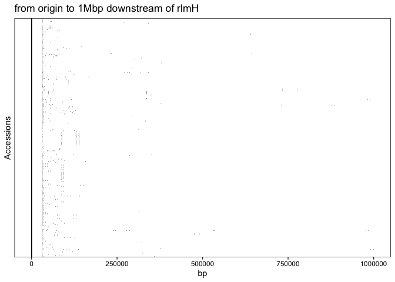<!-- -->

``` r
ggsave("figures/IS431mec_Sepi_1Mbp_linear.pdf", width = 6, height = 2)
```

    ## Warning: Removed 2 rows containing missing values or values outside the scale range
    ## (`geom_segment()`).

``` r
histogram_IS431 <- blast %>% filter(pident > 98) %>%
  ggplot(aes(x=sstart)) +
  geom_density(fill="black")+
  xlab("bp")+
  theme(panel.background = element_blank(),
        axis.text.y = element_blank(),
        axis.ticks.y = element_blank(),
        axis.text = element_text(color="black"),
        panel.border = element_rect(color="white"))
  
histogram_IS431
```

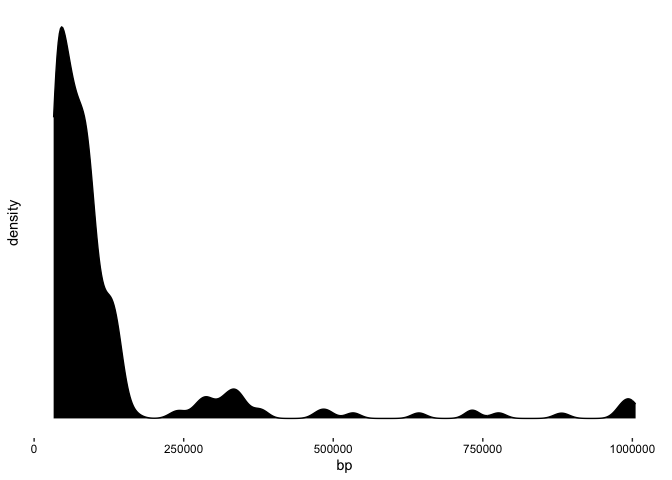<!-- -->

``` r
# Just RP62A:
blast %>% filter(Assembly == "GCF_000011925.1") %>% 
  ggplot(aes(y=Accession))+
  geom_segment(aes(y=Accession, x=sstart, xend=send), col="red")+
  geom_segment(data = rlmH %>% filter(Assembly == "GCF_000011925.1"), 
               aes(y=Contig_ID, 
                   x=rlmH_relative_start, 
                   xend= rlmH_relative_end), 
               col="black")+
  geom_vline(xintercept = 0)+
  xlab("dnaA = bp position 0; black = rlmH gene, red = identified IS431meclike")+
  ylab("Accessions")+
  ggtitle("from origin to 1Mbp downstream of rlmH; RP62A only")+
  theme_minimal()+
#  scale_x_continuous(breaks = seq(0,340000,10000),
#                     labels = seq(0,340000,10000)/10000)+
  xlim(0,100000)+
  xlab("bp (kb)")
```

    ## Warning: Removed 4 rows containing missing values or values outside the scale range
    ## (`geom_segment()`).

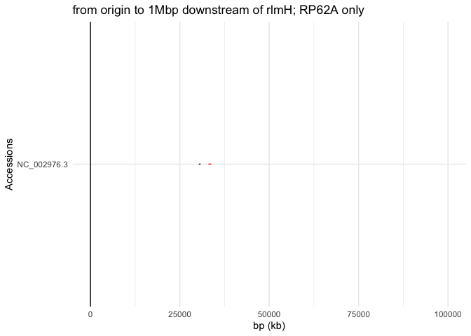<!-- -->

``` r
hist(blast$sstart)
```

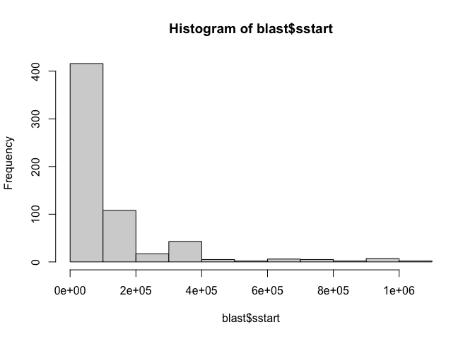<!-- -->

## ISEScan analysis

Using the same fasta files named
`~/StaphEpi/dnaA_to_rlmH_fasta_per_assembly_1Mbp/{genome}_dnaA0_rlmHplus1Mbp.fasta`,
we will use the program ISEScan.

This part of the analysis was performed on the Center for High
Throughput Computing (CHTC).

First we need to organize the data by copying this all into the
ResearchDrive CHTC folder to use as input:

``` bash
mkdir -p /Volumes/ptran5/CHTC/StaphEpi/input/dnaA_to_rlmH_plus_1Mbp
cp ~/StaphEpi/dnaA_to_rlmH_fasta_per_assembly_1Mbp/*.fasta /Volumes/ptran5/CHTC/StaphEpi/input/dnaA_to_rlmH_plus_1Mbp/.

# Remove files we don't need
rm /Volumes/ptran5/CHTC/StaphEpi/input/dnaA_to_rlmH_plus_1Mbp/all.fasta*
rm /Volumes/ptran5/CHTC/StaphEpi/input/dnaA_to_rlmH_plus_1Mbp/IS431-meclike.fasta
rm /Volumes/ptran5/CHTC/StaphEpi/input/dnaA_to_rlmH_plus_1Mbp/*.tsv

# Make a list of all the fasta files in /Volumes/ptran5/CHTC/StaphEpi/input/dnaA_to_rlmH_plus_1Mbp/ and copy it over to CHTC and name it samples.txt

ls /Volumes/ptran5/CHTC/StaphEpi/input/dnaA_to_rlmH_plus_1Mbp/ > samples.txt

sed 's|.fasta||g' samples.txt > samples_list.txt

# Transfer it to chtc:

scp samples_list.txt [login@login.address]:~/all/github_test/staphepi_IS/samples.txt
```

### Submit high-throughput jobs on CHTC

We will use HTcondor to submit 201 ISEScan jobs. To do that, we will
need :

- a container image with ISEScan in it

- a submit file

- an executable file

<!-- -->

    ### Log into chtc ###
    cd ~/all/github_test/staphepi_IS

    # Make sure the isescan.sh and isescan.sub path are correct.

    # Submit the job

    condor_submit isescan.sub

Once all the jobs are done, they will be transferred back to
ResearchDrive at this path: `/Volumes/ptran5/CHTC/StaphEpi/ISEScan/1Mbp`
or wherever specified in the HTCondor `transfer_output_files=` path.

All the CHTC HTCondor scripts are found in the folder
[htcondor_scripts](./htcondor_scripts/).

### Plotting:

**Important:** Since this is in ResearchDrive so connect to VPN and then
connect to the ResearchDrive using Finder “Connect to Server”.

Note the folder 1Mbp referred to in the section below is approximately
700MB and is not uploaded to Github. Please see supplementary data for
more information.

``` r
folder_path <- "/Volumes/ptran5/CHTC/StaphEpi/ISEScan/1Mbp" # Replace with your folder path
files <- list.files(path = folder_path, pattern = ".*dnaA.*.tsv", full.names = TRUE)
#files
length(files)
```

    ## [1] 201

``` r
# this should say 201. 

# Only keep files with data:
files <- files[file.info(files)$size > 0]
#files
length(files)
```

    ## [1] 200

``` r
# This should say 200.

data_list <- lapply(files, function(x) read.table(x, sep="\t", header=TRUE))

# combine them all:
data_all <- data_list %>% reduce(full_join)

# Split seqID:
data_all <- data_all %>% 
  separate(seqID, sep="_NZ|_NC", remove = FALSE, into=c("Assembly", "Accession")) %>% 
  mutate(Accession = ifelse(grepl("_NZ",seqID), paste0("NZ", Accession), 
                            paste0("NC", Accession)),
         Accession = str_replace(Accession, "_dnaA0_.*",""))

# Plot:

IS_all_plot <- data_all %>% 
  # complete elements only
  filter(type == "c") %>%
  ggplot(aes(y=Accession))+
  geom_segment(aes(y=Accession, x=isBegin, xend=isEnd, col=family))+
  geom_segment(data = rlmH, aes(y=Contig_ID, x=rlmH_relative_start, xend= rlmH_relative_end), col="black")+
  #xlab("dnaA = bp position 0; red = rlmH gene, black dots = identified IS431meclike")+
  #ylab("Accessions")+
  theme_minimal()+
  ggtitle("from origin to 1Mbp downstream of rlmH")+
  theme(axis.text.y = element_blank())+
  #scale_x_continuous(breaks = seq(0,1000000,100000),
  #                   labels = seq(0,1000000,100000)/100000)+
    geom_vline(xintercept = 0)+
  coord_polar()+
  xlab("bp")

IS_all_plot
```

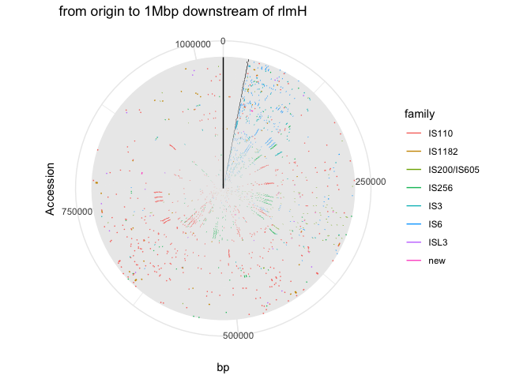<!-- -->

``` r
ggsave("figures/ISplot_1Mbp.pdf", width = 10, height = 4)

# Linear
IS_all_plot_linear <- data_all %>% 
  # complete elements only
  filter(type == "c") %>%
  ggplot(aes(y=Accession))+
  geom_segment(aes(y=Accession, x=isBegin, xend=isEnd, col=family))+
  geom_segment(data = rlmH, aes(y=Contig_ID, x=rlmH_relative_start, xend= rlmH_relative_end), col="black")+
  ggtitle("from origin to 1Mbp downstream of rlmH")+
  theme(axis.text.y = element_blank())+
    geom_vline(xintercept = 0)+
  xlab("bp")+
    theme(panel.background = element_blank(),
        axis.text.y = element_blank(),
        axis.ticks.y = element_blank(),
        axis.text = element_text(color="black"),
        panel.border = element_rect(color="black"),
        legend.key.size = unit(0.2, 'cm'))+
  xlim(0,1000000)

IS_all_plot_linear
```

    ## Warning: Removed 28 rows containing missing values or values outside the scale range
    ## (`geom_segment()`).

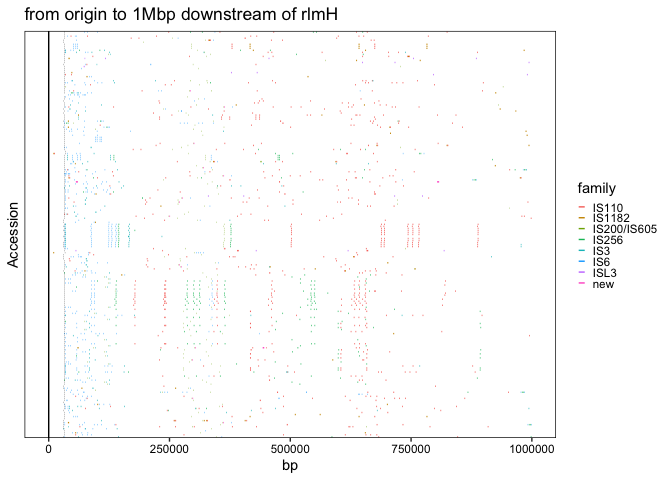<!-- -->

``` r
ggsave("figures/ISplot_1Mbp_linear.pdf", width =6, height = 2.5)
```

    ## Warning: Removed 28 rows containing missing values or values outside the scale range
    ## (`geom_segment()`).

``` r
# RP62A:
data_all %>% 
  # complete elements only
  filter(type == "c") %>%
  filter(Assembly == "GCF_000011925.1") %>%
  ggplot(aes(y=Accession))+
  geom_segment(aes(y=Accession, 
                   x=isBegin, 
                   xend=isEnd, 
                   col=family))+
  geom_segment(data = rlmH %>% filter(Assembly == "GCF_000011925.1"), 
               aes(y=Contig_ID, 
                   x=rlmH_relative_start, 
                   xend= rlmH_relative_end), 
               col="black")+
  theme_minimal()+
  ggtitle("from origin to 1Mbp downstream of rlmH")+
  theme(axis.text.y = element_blank())+
  coord_polar()+
  xlab("bp (kb)")
```

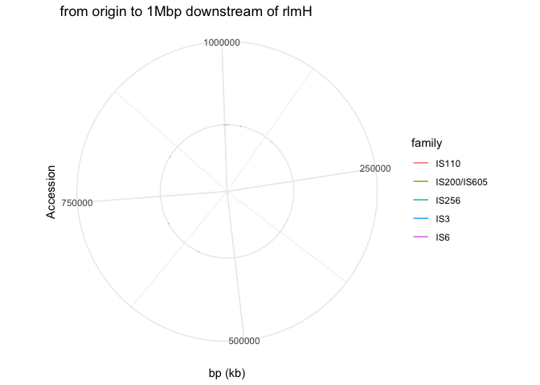<!-- -->

### More plots

``` r
data_all %>% filter(type == "c") %>%
  group_by(family) %>% tally() %>%
  ggplot(aes(x=family, y=n))+
  geom_col()
```

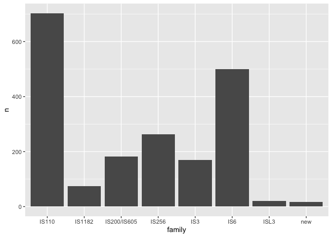<!-- -->

``` r
data_all %>% filter(type == "c") %>%
  group_by(family, cluster) %>% tally() %>%
  ggplot(aes(x=cluster, y=n))+
  geom_col()+
  theme_minimal()+
  theme(axis.text.x = element_text(angle=90))
```

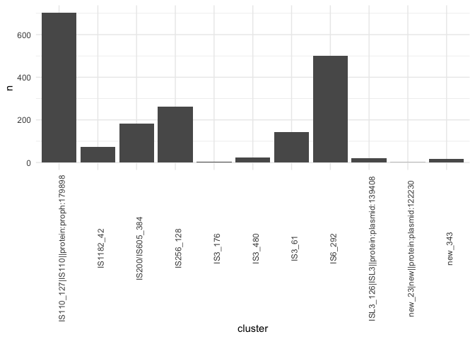<!-- -->

# DefenseFinder

In the Hossain et al., paper
(<https://www.nature.com/articles/s41467-024-53146-z>), the authors
showed that there was a high concentration of defense and anti-defense
systems downstream of rlmH.

We are running defense-finder (same tool as in their paper) v.2.0.0
(<https://github.com/mdmparis/defense-finder>) and will plot a similar
circular figure for our analysis. The input files are the same
`dnaA_rlmH_plus_1Mp` oriented genome segments.

## Submitting the DefenseFinder jobs on CHTC

The scripts to are this are : `defensefinder.sh`, `defensefinder.sh` and
the Apptainer definition file to build the container image is
`defensefinder.def`. The submit file also needs a `samples.txt` file
listing the fasta sequence.

All these scripts can be found in the folder
[./htcondor_scripts](./htcondor_scripts).

**Note**: If we already ran the `isescan.sub` script previously, it uses
the same input files, so no need to reorganize that. It also uses the
exact same `samples.txt` file.

The input for DefenseFinder are fasta files. We will use the
same-orientation files from this folder:
`dnaA_to_rlmH_fasta_per_assembly_1Mbp/*.fasta`. We first need to copy
them from our local laptop location to the ResearchDrive input folder
location. The job can be submitted using
`condor_submit defensefinder.sub` once logged into the CHTC access
point.

HTcondor will submit 201 jobs.

The folder with the DefenseFolder results is about 25MB and is not
uploaded to Github, but can be found in a compressed format in the
Supplementary Materials. A combined version of all the tables can also,
instead, be found at this location:
[tables/defense_finder_all.tsv](tables/defense_finder_all.tsv)

## Visualizing the output files

``` r
folder_path <- "/Volumes/ptran5/CHTC/StaphEpi/output" 
files <- list.files(path = folder_path, pattern = ".*defense_finder_genes.*1Mbp.tsv", full.names = TRUE)
length(files)
```

    ## [1] 201

``` r
#files
defense_data <- lapply(files, function(x) read.table(x, sep="\t", header=TRUE, quote = ""))


# Filter df with 0 rows:
defense_data_no_empty <- Filter(nrow, defense_data)

defense_data_all <- defense_data_no_empty %>% reduce(full_join)

summary(defense_data_all)
```

    ##       replicon         hit_id        gene_name      hit_pos     
    ##  Length   :767   Length   :767   Length   :767   Min.   : 23.0  
    ##  N.unique :151   N.unique :767   N.unique : 82   1st Qu.: 48.0  
    ##  N.blank  :  0   N.blank  :  0   N.blank  :  0   Median : 66.0  
    ##  Min.nchar: 46   Min.nchar: 49   Min.nchar:  5   Mean   :130.4  
    ##  Max.nchar: 48   Max.nchar: 52   Max.nchar: 48   3rd Qu.:102.0  
    ##                                                  Max.   :924.0  
    ##      model_fqn         sys_id       sys_loci   locus_num sys_wholeness   
    ##  Length   :767   Length   :767   Min.   :1   Min.   :1   Min.   :0.0710  
    ##  N.unique : 33   N.unique :327   1st Qu.:1   1st Qu.:1   1st Qu.:1.0000  
    ##  N.blank  :  0   N.blank  :  0   Median :1   Median :1   Median :1.0000  
    ##  Min.nchar: 33   Min.nchar: 52   Mean   :1   Mean   :1   Mean   :0.9744  
    ##  Max.nchar: 59   Max.nchar: 75   3rd Qu.:1   3rd Qu.:1   3rd Qu.:1.0000  
    ##                                  Max.   :1   Max.   :1   Max.   :1.0000  
    ##    sys_score        sys_occ         hit_gene_ref     hit_status 
    ##  Min.   :1.000   Min.   :1.000   Length   :767   Length   :767  
    ##  1st Qu.:2.000   1st Qu.:1.000   N.unique : 62   N.unique :  2  
    ##  Median :3.000   Median :1.000   N.blank  :  0   N.blank  :  0  
    ##  Mean   :3.645   Mean   :1.065   Min.nchar:  5   Min.nchar:  9  
    ##  3rd Qu.:3.000   3rd Qu.:1.000   Max.nchar: 48   Max.nchar:  9  
    ##  Max.   :9.000   Max.   :2.000                                  
    ##   hit_seq_len       hit_i_eval          hit_score      hit_profile_cov 
    ##  Min.   :  83.0   Min.   :0.000e+00   Min.   :  24.4   Min.   :0.4220  
    ##  1st Qu.: 302.0   1st Qu.:0.000e+00   1st Qu.: 110.1   1st Qu.:0.8080  
    ##  Median : 423.0   Median :0.000e+00   Median : 276.5   Median :0.9680  
    ##  Mean   : 487.8   Mean   :5.372e-09   Mean   : 355.6   Mean   :0.8901  
    ##  3rd Qu.: 596.0   3rd Qu.:0.000e+00   3rd Qu.: 598.5   3rd Qu.:0.9920  
    ##  Max.   :1091.0   Max.   :9.400e-07   Max.   :1071.1   Max.   :1.0000  
    ##   hit_seq_cov     hit_begin_match  hit_end_match    counterpart   
    ##  Min.   :0.3280   Min.   :  1.00   Min.   :  73.0   Mode:logical  
    ##  1st Qu.:0.8355   1st Qu.:  2.00   1st Qu.: 269.0   NAs :767      
    ##  Median :0.9640   Median :  4.00   Median : 413.0                 
    ##  Mean   :0.8927   Mean   : 16.84   Mean   : 461.6                 
    ##  3rd Qu.:0.9790   3rd Qu.: 12.00   3rd Qu.: 517.0                 
    ##  Max.   :0.9990   Max.   :279.00   Max.   :1071.0                 
    ##       used_in           type          subtype         activity  
    ##  Length   :767   Length   :767   Length   :767   Length   :767  
    ##  N.unique :120   N.unique : 28   N.unique : 33   N.unique :  2  
    ##  N.blank  :182   N.blank  :  0   N.blank  :  0   N.blank  :  0  
    ##  Min.nchar:  0   Min.nchar:  2   Min.nchar:  3   Min.nchar:  7  
    ##  Max.nchar:133   Max.nchar: 11   Max.nchar: 24   Max.nchar: 11  
    ##  NAs      :125

``` r
head(defense_data_all)
```

    ##                                         replicon
    ## 1 GCF_000007645.1_NC_004461.1_dnaA0_rlmHplus1Mbp
    ## 2 GCF_000011925.1_NC_002976.3_dnaA0_rlmHplus1Mbp
    ## 3 GCF_000011925.1_NC_002976.3_dnaA0_rlmHplus1Mbp
    ## 4 GCF_000011925.1_NC_002976.3_dnaA0_rlmHplus1Mbp
    ## 5 GCF_000011925.1_NC_002976.3_dnaA0_rlmHplus1Mbp
    ## 6 GCF_000011925.1_NC_002976.3_dnaA0_rlmHplus1Mbp
    ##                                              hit_id
    ## 1 GCF_000007645.1_NC_004461.1_dnaA0_rlmHplus1Mbp_41
    ## 2 GCF_000011925.1_NC_002976.3_dnaA0_rlmHplus1Mbp_68
    ## 3 GCF_000011925.1_NC_002976.3_dnaA0_rlmHplus1Mbp_70
    ## 4 GCF_000011925.1_NC_002976.3_dnaA0_rlmHplus1Mbp_72
    ## 5 GCF_000011925.1_NC_002976.3_dnaA0_rlmHplus1Mbp_73
    ## 6 GCF_000011925.1_NC_002976.3_dnaA0_rlmHplus1Mbp_75
    ##                               gene_name hit_pos
    ## 1                            AbiJ__AbiJ      41
    ## 2                            Stk2__Stk2      68
    ## 3                         SEFIR__bSEFIR      70
    ## 4                              Nhi__Nhi      72
    ## 5 RM__Type_I_REases_FAM_0.einsi_trimmed      73
    ## 6               RM__Type_I_MTases_FAM_0      75
    ##                                         model_fqn
    ## 1   defense-finder-models/DefenseFinder/AbiJ/AbiJ
    ## 2   defense-finder-models/DefenseFinder/Stk2/Stk2
    ## 3 defense-finder-models/DefenseFinder/SEFIR/SEFIR
    ## 4     defense-finder-models/DefenseFinder/Nhi/Nhi
    ## 5           defense-finder-models/RM/RM/RM_Type_I
    ## 6           defense-finder-models/RM/RM/RM_Type_I
    ##                                                       sys_id sys_loci locus_num
    ## 1      GCF_000007645.1_NC_004461.1_dnaA0_rlmHplus1Mbp_AbiJ_1        1         1
    ## 2      GCF_000011925.1_NC_002976.3_dnaA0_rlmHplus1Mbp_Stk2_3        1         1
    ## 3     GCF_000011925.1_NC_002976.3_dnaA0_rlmHplus1Mbp_SEFIR_2        1         1
    ## 4       GCF_000011925.1_NC_002976.3_dnaA0_rlmHplus1Mbp_Nhi_1        1         1
    ## 5 GCF_000011925.1_NC_002976.3_dnaA0_rlmHplus1Mbp_RM_Type_I_5        1         1
    ## 6 GCF_000011925.1_NC_002976.3_dnaA0_rlmHplus1Mbp_RM_Type_I_5        1         1
    ##   sys_wholeness sys_score sys_occ                          hit_gene_ref
    ## 1             1         1       1                            AbiJ__AbiJ
    ## 2             1         1       1                            Stk2__Stk2
    ## 3             1         1       1                         SEFIR__bSEFIR
    ## 4             1         1       1                              Nhi__Nhi
    ## 5             1         3       1 RM__Type_I_REases_FAM_0.einsi_trimmed
    ## 6             1         3       1               RM__Type_I_MTases_FAM_0
    ##   hit_status hit_seq_len hit_i_eval hit_score hit_profile_cov hit_seq_cov
    ## 1  mandatory         267    6.6e-11      37.9           0.662       0.753
    ## 2  mandatory         503   3.5e-291     961.8           0.998       0.998
    ## 3  mandatory         440    1.3e-66     221.7           0.845       0.991
    ## 4  mandatory         607   1.9e-173     573.2           0.998       0.806
    ## 5  mandatory         931   3.6e-192     637.0           0.930       0.973
    ## 6  mandatory         519   3.0e-180     596.2           0.992       0.979
    ##   hit_begin_match hit_end_match counterpart
    ## 1              61           261          NA
    ## 2               1           502          NA
    ## 3               1           436          NA
    ## 4               1           489          NA
    ## 5               1           906          NA
    ## 6               7           514          NA
    ##                                                 used_in  type   subtype
    ## 1                                                  <NA>  AbiJ      AbiJ
    ## 2                                                        Stk2      Stk2
    ## 3                                                       SEFIR     SEFIR
    ## 4                                                         Nhi       Nhi
    ## 5 GCF_000011925.1_NC_002976.3_dnaA0_rlmHplus1Mbp_PrrC_4    RM RM_Type_I
    ## 6 GCF_000011925.1_NC_002976.3_dnaA0_rlmHplus1Mbp_PrrC_4    RM RM_Type_I
    ##   activity
    ## 1  Defense
    ## 2  Defense
    ## 3  Defense
    ## 4  Defense
    ## 5  Defense
    ## 6  Defense

``` r
defense_data_all <- defense_data_all %>% 
  separate(replicon, sep="_NZ|_NC", remove = FALSE, into=c("Assembly", "Accession")) %>% 
  mutate(Accession = ifelse(grepl("_NZ",replicon), 
                            paste0("NZ", Accession), 
                            paste0("NC", Accession)),
         Accession = str_replace(Accession, "_dnaA0_.*",""))


defense_plot <- defense_data_all %>% 
  ggplot(aes(x=hit_pos, 
             y=Accession, 
             fill=type))+
    geom_vline(xintercept = 1)+
  geom_tile()+
  #geom_segment(data = rlmH, aes(y=Contig_ID, x=rlmH_relative_start, xend= rlmH_relative_end), col="black")+ 
  #coord_polar()+
  theme_minimal()+
  ggtitle("Defense and anti-defense systems from origin (dnaA) to 1Mbp downstream of rlmH")+
  theme(axis.text.y = element_blank()
        )+
  scale_x_continuous(breaks = seq(0,1000,100),
                     labels = seq(0,1000,100))+
  
xlab("Protein position relative to the origin")+
coord_radial(expand = FALSE)+
  theme(
    panel.background = element_rect(fill = NA, color = "black") # Set fill color and remove border
  )
 

defense_plot
```

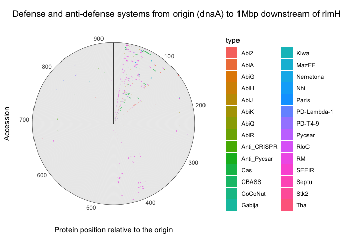<!-- -->

``` r
ggsave("figures/defenseplot_Sepi_1Mbp.pdf", width = 10, height = 4)

defense_plot_linear <- defense_data_all %>% 
  ggplot(aes(x=hit_pos, 
             y=Accession, 
             fill=type))+
    geom_vline(xintercept = 1)+
  geom_tile()+
  #geom_segment(data = rlmH, aes(y=Contig_ID, x=rlmH_relative_start, xend= rlmH_relative_end), col="black")+ 
  #coord_polar()+
  theme_minimal()+
  ggtitle("Defense and anti-defense systems from origin (dnaA) to 1Mbp downstream of rlmH")+
  theme(axis.text.y = element_blank()
        )+
  scale_x_continuous(breaks = seq(0,1000,100),
                     labels = seq(0,1000,100))+
xlab("Protein position relative to the origin")+
      theme(panel.background = element_blank(),
        axis.text.y = element_blank(),
        axis.ticks.y = element_blank(),
        axis.text = element_text(color="black"),
        panel.border = element_rect(color="black"))

defense_plot_linear
```

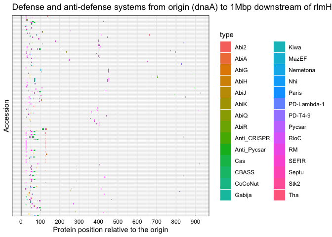<!-- -->

``` r
# This is Figure 1b.
library(cowplot)
defense_plot_linear_legend <- get_legend(defense_plot_linear)

defense_plot_linear_small_legend <- defense_data_all %>% 
  ggplot(aes(x=hit_pos, 
             y=Accession, 
             fill=type))+
    geom_vline(xintercept = 1)+
  geom_tile()+
  theme_minimal()+
  ggtitle("Defense and anti-defense systems from origin (dnaA) to 1Mbp downstream of rlmH")+
  scale_x_continuous(breaks = seq(0,1000,100),
                     labels = seq(0,1000,100))+
xlab("Protein position relative to the origin")+
      theme(panel.background = element_blank(),
            axis.text.y = element_blank(),
            axis.ticks.y = element_blank(),
            axis.text = element_text(color="black"),
            legend.key.size = unit(0.2, 'cm'),
             panel.border = element_rect(color="black"),
            panel.grid.minor = element_blank(),
            panel.grid.minor.y = element_blank(),
             panel.grid.major.y = element_blank())

defense_plot_linear_small_legend
```

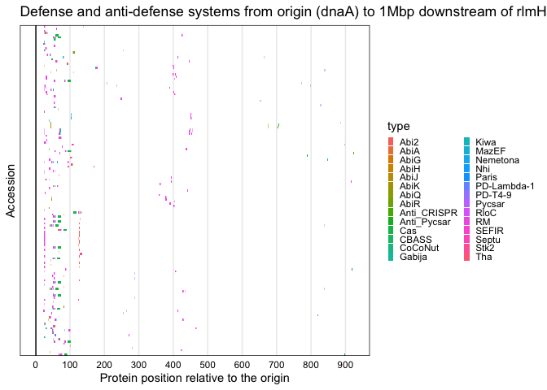<!-- -->

``` r
ggsave(plot=defense_plot_linear_small_legend, filename = "figures/defense_finder.pdf", width = 8, height = 4)

write.table(defense_data_all, "tables/defense_finder_all.tsv", sep="\t", row.names = FALSE, quote = FALSE)
```

# Final Figures

Some version of this is used for Supp Figure 4.

``` r
library(ggpubr)
```

    ## 
    ## Attaching package: 'ggpubr'

    ## The following object is masked from 'package:cowplot':
    ## 
    ##     get_legend

``` r
panelA <- ggarrange(histogram_IS431, plot431mec_linear, 
          labels=c("A",""), nrow=2, heights = c(0.4,1), 
          align="h")
```

    ## Warning: Removed 2 rows containing missing values or values outside the scale range
    ## (`geom_segment()`).

``` r
panelA
```

<!-- -->

``` r
ggarrange(panelA, 
          defense_plot_linear_small_legend, 
          nrow=2, 
          heights = c(1,0.5))
```

<!-- -->

``` r
ggsave("figures/FigureSupp4.pdf", width = 8.5, height = 6)


ggsave(plot=IS_all_plot_linear,filename="figures/SuppFigure_ISEScan.pdf", width = 6, height = 2.5)
```

    ## Warning: Removed 28 rows containing missing values or values outside the scale range
    ## (`geom_segment()`).
